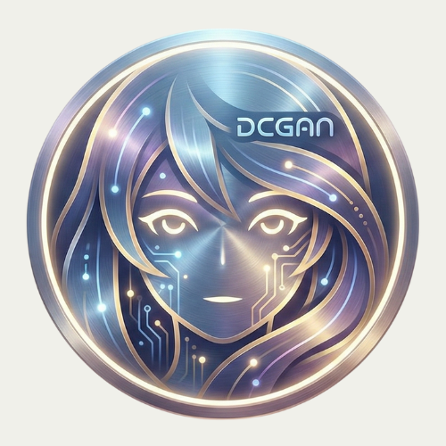

#👋 Welcome to DCGAN AnimeFaces Page

  

#🎨 Generate Anime Faces Using Deep Convolutional Generative Adversarial Network (DCGAN)

  
 
 <b>DCGAN AnimeFaces</b> adalah proyek Deep Learning yang memanfaatkan <b>Deep Convolutional Generative Adversarial Network (DCGAN)</b> untuk menghasilkan wajah anime baru yang unik dan realistis secara otomatis.    Proyek ini dirancang untuk mengeksplorasi kemampuan model generatif dalam menciptakan karakter anime dari nol, serta dilengkapi dengan <b>Random Search Hyperparameter Optimization</b> untuk memperoleh konfigurasi training terbaik dan hasil yang lebih stabil. 

#✨ Key Features
##🔹 1. Anime Face Generation (DCGAN)
Menghasilkan wajah anime beresolusi 64×64 px dari latent noise acak menggunakan arsitektur DCGAN yang sudah dioptimalkan.

##🔹 2. Random Search Hyperparameter Optimization
Menentukan kombinasi hyperparameter terbaik untuk meningkatkan kualitas generasi gambar, meliputi:
Learning Rate
Optimizer β1
Latent Dimension
Pendekatan ini membantu model mencapai proses learning yang lebih stabil dan mengurangi mode collapse.

##🔹 3. Stable Training Pipeline
Pipeline pelatihan yang lengkap dan stabil, mencakup:
Visualisasi tren loss
Auto-checkpoint
Grid sampling otomatis
Pembuatan GIF progres training

##🔹 4. Clean, Modular, Beginner-Friendly Notebook
Notebook dirancang terstruktur, rapi, dan mudah dipahami — ideal untuk mahasiswa atau peneliti yang ingin mempelajari GAN dari dasar.