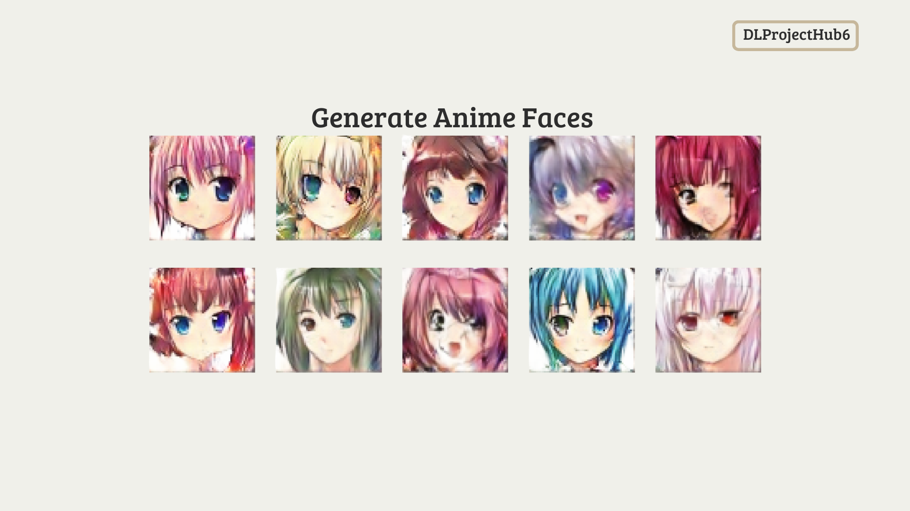

# ✦ Welcome To DCGAN AnimeFaces ✦


## 👋 DLProjectHub6

Kontributor:

<div align="center">

| **Nama** | **NPM** | **Universitas** |
|:--------:|:-------:|:---------------:|
| Reza Putri Angga | 22083010006 | UPN Veteran Jawa Timur |
| Larasati | 22083010018 | UPN Veteran Jawa Timur |
| Muhammad Azkiya Akmal | 22083010084 | UPN Veteran Jawa Timur |
| Vira Amalia Zahrani | 22083010098 | UPN Veteran Jawa Timur |
| R. Taufik Utomo Iswanindra Kusuma | 22083010108 | UPN Veteran Jawa Timur |

</div>


## Generate 𝓐𝓷𝓲𝓶𝓮 Faces With Deep Convolutional Generative Adversarial Network (DCGAN)

<p align="center">
  
  <br>
  <em>Siklus Pemodelan DCGAN AnimeFaces</em>
</p>

<p align="justify">
DCGAN AnimeFaces adalah proyek Deep Learning yang memanfaatkan 
<b>Deep Convolutional Generative Adversarial Network (DCGAN)</b> 
untuk menghasilkan wajah anime baru secara otomatis.
</p>

<p align="justify">
Proyek ini juga dilengkapi dengan <b>Random Search Hyperparameter Optimization</b> 
untuk menemukan konfigurasi training terbaik sehingga model lebih stabil dan mampu menghasilkan gambar berkualitas.
</p>

<p align="center">
  
  <br>
  <em>Result Generate DCGAN AnimeFaces</em>
</p>


## ✨ Key Features

**1. Anime Face Generation (DCGAN)**  
<p align="justify">
Model menghasilkan gambar wajah anime beresolusi <b>64×64 piksel</b> dari latent noise acak menggunakan arsitektur DCGAN yang telah dioptimalkan.
</p>

**2. Random Search Hyperparameter Optimization**  
<p align="justify">
Mencari kombinasi hyperparameter terbaik untuk meningkatkan kualitas generasi gambar, meliputi:
</p>

- Learning Rate  
- Optimizer β1  

<p align="justify">
Pendekatan ini membantu model mencapai proses pelatihan yang lebih stabil serta mengurangi risiko <b>mode collapse</b>.
</p>

**3. Stable Training Pipeline**  
<p align="justify">
Proyek menyediakan pipeline pelatihan yang rapi dan terstruktur, mencakup:
</p>

- Visualisasi tren loss  
- Auto-checkpoint  
- Grid sampling otomatis  
- Pembuatan GIF progres training  

**4. Clean, Modular, Beginner-Friendly Notebook**  
<p align="justify">
Notebook dirancang agar mudah dipahami dan dipelajari.
</p>


## 🗂️ Project Structure

```text
📁 DCGAN-AnimeFaces/
│
├── 📁 data/
│   └── Dataset AnimeFaces 
│
├── 📁 outputs/
│   └── Hasil Generate 
│   
├── 📄 PJBL_Kelompok 6_Deep Learning.ipynb
│   └── Notebook Utama (Pelatihan & Eksperimen DCGAN)
│
├── 📄 requirements.txt
│   └── Dependensi Proyek
│
├── 📄 Laporan_PJBL_Kelompok6_DeepLearning.pdf
│   └── Laporan Akhir Proyek
│
└── 📄 README.md
```


## 🚀 How To Run
**1. Clone Repository**  

git clone https://github.com/yourusername/DCGAN-AnimeFaces.git

cd DCGAN-AnimeFaces

**2. Install Dependencies Dari requirements.txt**  

pip install -r requirements.txt

**3. Download Dataset**  

kaggle datasets download -d splcher/animefacedataset

**4. Run Notebook**  

Google Collaboratory PJBL_Kelompok 6_Deep Learning.ipynb


## 📂 Datasets 

[**Dataset**](https://www.kaggle.com/datasets/splcher/animefacedataset)


## 🛠️ Languages And Tools

<p>
  
  
  
  
  
  
</p>