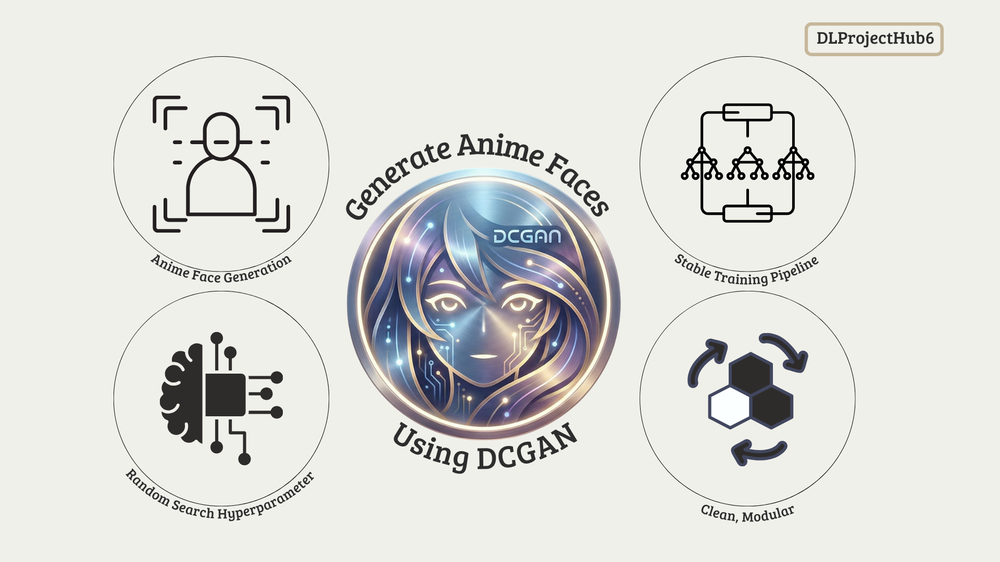

## Welcome To DCGAN AnimeFaces!
## 🎨 Generate Anime Faces With Deep Convolutional Generative Adversarial Network (DCGAN)

  

DCGAN AnimeFaces adalah proyek Deep Learning yang memanfaatkan 
<b>Deep Convolutional Generative Adversarial Network (DCGAN)</b> 
untuk menghasilkan wajah anime baru secara otomatis.

Proyek ini juga dilengkapi dengan <b>Random Search Hyperparameter Optimization</b> 
untuk menemukan konfigurasi training terbaik sehingga model lebih stabil dan mampu menghasilkan gambar berkualitas.

## ✨ Key Features

**1. Anime Face Generation (DCGAN)**  

Model menghasilkan gambar wajah anime beresolusi <b>64×64 px</b> dari latent noise acak menggunakan arsitektur DCGAN yang telah dioptimalkan.

**2. Random Search Hyperparameter Optimization**  

Mencari kombinasi hyperparameter terbaik untuk meningkatkan kualitas generasi gambar, meliputi:

- Learning Rate  
- Optimizer β1  

Pendekatan ini membantu model mencapai proses pelatihan yang lebih stabil serta mengurangi risiko <b>mode collapse</b>.

**3. Stable Training Pipeline**  

Proyek menyediakan pipeline pelatihan yang rapi dan terstruktur, mencakup:

- Visualisasi tren loss  
- Auto-checkpoint  
- Grid sampling otomatis  
- Pembuatan GIF progres training  

**4. Clean, Modular, Beginner-Friendly Notebook**  

Notebook dirancang agar mudah dipahami dan dipelajari.

## 📂 Datasets 
### Dataset:

📘 **Dataset:**  
https://www.kaggle.com/datasets/splcher/animefacedataset

---

## 🛠️ Languages And Tools

  
  
  
  
  

## DLProjectHub6

| 
<b>Nama</b>
 | 
<b>NPM</b>
 | 
<b>Universitas</b>
 |
|---------------------------------------|---------------------------------------|----------------------------------------------|
| Reza Putri Angga                      | 22083010006                           | Universitas Pembangunan Nasional Veteran Jawa Timur |
| Larasati                              | 22083010018                           | Universitas Pembangunan Nasional Veteran Jawa Timur |
| Muhammad Azkiya Akmal                 | 22083010084                           | Universitas Pembangunan Nasional Veteran Jawa Timur |
| Vira Amalia Zahrani                   | 22083010098                           | Universitas Pembangunan Nasional Veteran Jawa Timur |
| R. Taufik Utomo Iswanindra Kusuma     | 22083010108                           | Universitas Pembangunan Nasional Veteran Jawa Timur |

